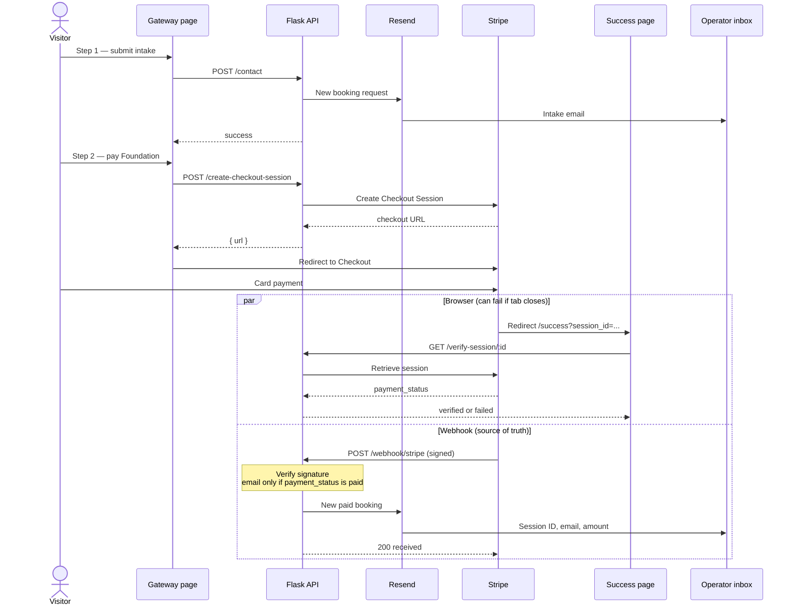

# Castillo Longevity Code

Marketing and booking site for **Castillo Longevity Code**, a lifestyle and nutrition practice. Visitors learn about the program, review research sources and testimonials, then complete a two-step consultation intake and pay a one-time Foundation Track setup fee through Stripe.

- **Frontend** — React + TypeScript + Vite (`frontend/`). Pages are chosen from `window.location.pathname`.
- **Backend** — Flask (`api/`). Contact, Stripe checkout, payment verification, webhooks, optional chat.

---

## Quick start

You need **two terminals**, a `.env` in `api/` (see [Environment variables](#environment-variables)), and Stripe keys if you want checkout to work.

**1. API** — from `api/`:

```bash
pip install -r ../requirements.txt
python index.py
```

Listens on `http://127.0.0.1:5000`.

**2. Frontend** — from `frontend/`:

```bash
npm install
npm run dev
```

Open `http://localhost:5173`. Use `/gateway` for intake and payment. For webhooks while paying locally, forward Stripe to `http://localhost:5000/webhook/stripe` (Stripe CLI or Dashboard) and set `STRIPE_WEBHOOK_SECRET` to that endpoint’s secret.

---


## Payment and webhook path

Two independent paths run after the visitor pays. The **browser** is for UX. The **webhook** is what you trust for “this person paid.”




Cancel goes back to `/gateway`. Async methods can fire `checkout.session.completed` before money clears; the webhook handler waits for `payment_status == paid` (or a later `checkout.session.async_payment_succeeded`).

---


## How a visitor uses the site

```
Home (/)  →  Learn more (/learn-more)  →  Gateway (/gateway)
                                              │
                                    1. Clinical intake form
                                    2. Stripe Checkout ($1000)
                                              │
                                    Success (/success) after payment
```

1. **Home** introduces the practice and links to Learn more and Contact (gateway).
2. **Learn more** lists research sources and testimonials.
3. **Gateway** requires a successful intake (name, email, phone, notes) before payment is shown. Intake is emailed to the operator via Resend. Payment opens Stripe Checkout for the Foundation plan.
4. After a successful card payment, Stripe redirects to `/success?session_id=...`. The page asks the API to confirm the session is paid. Independently, Stripe’s webhook notifies the operator by email so a closed tab or failed redirect does not lose the booking.

Legal pages (`/privacy`, `/terms`, `/disclaimer`, `/refunds`) are static copy with a shared header and footer.

---


## Pages and routing

There is no React Router. `frontend/src/App.tsx` reads `window.location.pathname` and renders the matching layout.


| Path                                            | What it shows                                               |
| ----------------------------------------------- | ----------------------------------------------------------- |
| `/`                                             | Header, hero, about, footer                                 |
| `/learn-more`                                   | Alternate header, research sources, testimonials, footer    |
| `/gateway`                                      | Header, two-step consultation (intake then payment), footer |
| `/success`                                      | Payment verification UI (no site chrome)                    |
| `/privacy`, `/terms`, `/disclaimer`, `/refunds` | Legal documents + footer                                    |


Vercel is configured to serve the Vite build and rewrite unknown paths to `index.html` so these URLs work on refresh.

**Currently unused in the live UI** (code exists, imports commented out in `App.tsx`): bio, health tips, and the chat widget.

---


## Frontend


| Item             | Location                                                           |
| ---------------- | ------------------------------------------------------------------ |
| Entry            | `frontend/src/main.tsx` → `App.tsx`                                |
| Pages / sections | `frontend/src/components/`                                         |
| API clients      | `frontend/src/configs/` (`contact.ts`, `pricing.ts`, `chatbot.ts`) |
| Styles           | `frontend/src/styles/` (plus `index.css` / `global.css`)           |


The frontend talks to the Flask app with **hardcoded local URLs**:

- Contact: `http://127.0.0.1:5000/contact`
- Checkout / verify: `http://localhost:5000/create-checkout-session` and `/verify-session/<id>`
- Chat: `http://localhost:5000/api/chat`

Those hosts must match wherever the API actually runs in production.

---


## Backend (Flask)

`api/index.py` builds the app, enables CORS for local Vite (`localhost:5173` / `127.0.0.1:5173`, `localhost:3000`) plus optional `FRONTEND_URL`, and registers blueprints.


| Route                          | Method | Role                                                         |
| ------------------------------ | ------ | ------------------------------------------------------------ |
| `/contact`                     | POST   | Validate intake; email operator via Resend                   |
| `/create-checkout-session`     | POST   | Create Stripe Checkout for plan `"Foundation"`               |
| `/verify-session/<session_id>` | GET    | Confirm Stripe session `payment_status == paid`              |
| `/webhook/stripe`              | POST   | Verify Stripe signature; on paid checkout, email operator    |
| `/api/chat`                    | POST   | Stream assistant replies (local Ollama; not wired in the UI) |


`api/resend_webhook.py` defines `/webhook/resend` but is **not registered** in `create_app()` and the handler is a stub.

Production-style process: `api/Procfile` runs Gunicorn (`index:app`). Request bodies are capped at 1 MB.

### Contact intake

`api/contact.py` requires name, email, phone, and message. Email and E.164-style phone (after stripping spaces/dashes) are validated. Resend sends **one** email to `YOUR_EMAIL` from `RESEND_SENDER_EMAIL`. An auto-reply to the visitor is present in code but commented out (typical Resend sandbox restriction).

### Payments

`api/pricing.py` maps plan name `Foundation` to a Stripe Price ID. Checkout mode is **one-time payment** (not subscription). Success and cancel URLs in the API currently point at `http://localhost:5173/success` and `/gateway`.

`api/stripe_webhook.py` is the operator’s source of truth for money: it verifies `STRIPE_WEBHOOK_SECRET`, handles `checkout.session.completed` and `checkout.session.async_payment_succeeded`, and only emails when `payment_status` is `paid`. Failed/expired sessions are logged. Email failures do not fail the webhook response.

### Chat (optional)

`api/chat.py` uses the OpenAI-compatible client against **Ollama** (`http://localhost:11434/v1`, model `llama3.2:latest`). It streams plain text, trims history, and prepends `api/systemPrompt.txt` (currently empty, so a fallback prompt is used). The widget in `frontend/src/components/chatbot.tsx` is not mounted.

---


## External services


| Service            | Used for                                     |
| ------------------ | -------------------------------------------- |
| **Stripe**         | Checkout, session retrieval, signed webhooks |
| **Resend**         | Operator emails (intake + paid booking)      |
| **Ollama** (local) | Chat completions, if you enable the widget   |
| **Vercel**         | Static frontend build (`vercel.json`)        |


Python dependencies: `api` via `requirements.txt` (Flask, CORS, Stripe, Resend, OpenAI client, Gunicorn, dotenv, Flask-Limiter listed but not used in the files above). Frontend: React 19, Vite 8.

---


## Environment variables

Create a `.env` next to the API (loaded by `python-dotenv` in `index.py`). Do not commit secrets.


| Variable                | Purpose                                       |
| ----------------------- | --------------------------------------------- |
| `RESEND_API_KEY`        | Resend API key                                |
| `RESEND_SENDER_EMAIL`   | From address (verified domain or sandbox)     |
| `YOUR_EMAIL`            | Operator inbox for intake and payment notices |
| `STRIPE_API_KEY`        | Stripe secret key                             |
| `STRIPE_WEBHOOK_SECRET` | Signing secret for `/webhook/stripe`          |
| `FRONTEND_URL`          | Extra CORS origin (no trailing slash)         |
| `FLASK_DEBUG`           | Set `true` to run Flask debug locally         |


---


## Local development

**API** (from `api/`):

```bash
pip install -r ../requirements.txt
python index.py
```

Listens on `127.0.0.1:5000`. Debug only if `FLASK_DEBUG=true`.

**Frontend** (from `frontend/`):

```bash
npm install
npm run dev
```

Vite typically serves `http://localhost:5173`. Keep the Flask process running for intake, checkout, and success-page verification.

**Stripe webhooks locally:** point Stripe CLI or the Dashboard at `http://localhost:5000/webhook/stripe` and use the matching signing secret.

---


## Production notes

- Frontend deploy: `vercel.json` runs `cd frontend && npm install && npm run build` and publishes `frontend/dist`.
- The Flask API is a separate process (Gunicorn). CORS and all `fetch` URLs must use the real API and frontend hosts, not only localhost.
- Checkout `success_url` / `cancel_url` in `pricing.py` should use the live site, not `localhost:5173`.
- Register Stripe’s webhook on the public `/webhook/stripe` URL. 

